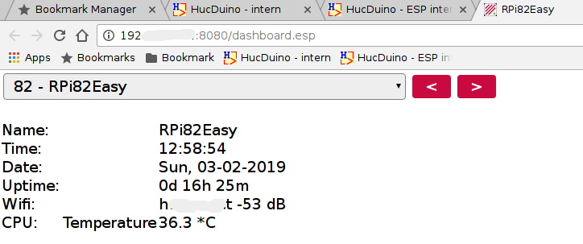
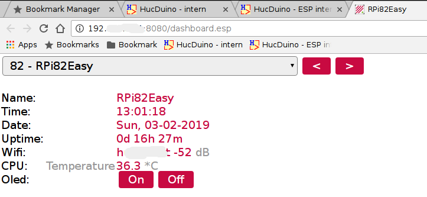
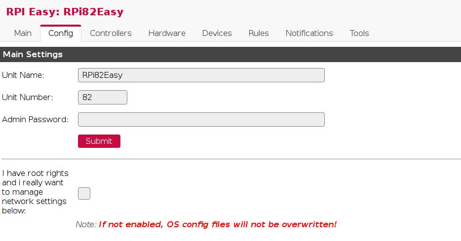
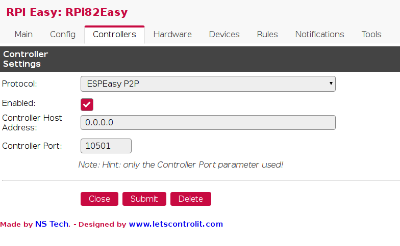

# RPiEasy dashboard.esp (basic) example
dashboard.esp (basic) example for RPiEasy

* RPiEasy is a Easy MultiSensor device based on Raspberry PI project from
  enesbcs (Alexander Nagy) https://github.com/enesbcs/rpieasy

 Example basic 1 dashboard.esp , you can find the file in the dashboard-1 directory.

 Example basic 2 dashboard.esp , you can find the file in the dashboard-2 directory.

Do you want to let the page automatically refresh, 
  then place this rule (Customize IP and port) on the 2nd line in the dashboard.esp file.
  
* `<meta http-equiv="Refresh" content="10; URL=http://[you RPiEasy ip]:[port]/dashboard.esp">`

## Getting started: ##
* copy one of the files from the `dashboard-1` or `dashboard-2` in the **/rpieasy/files** directory.
I think you also need :
* ** Unit Name:** and **Unit Number:**

* **ESPEasy P2P** Protocol and a Controller Port. 

  
## Accessing the Dashboard: ##
* You can access the dashboard by navigating to **http://[you RPiEasy ip]:[port]/dashboard.esp** through your web browser.

For more information see : https://www.letscontrolit.com/wiki/index.php/Mini_Dashboard
  (I don't know if all examples work with RPiEasy but maybe for the tips and tricks)

## useful links: ##
*  https://github.com/enesbcs/rpieasy
*  https://www.letscontrolit.com/wiki/index.php/Mini_Dashboard
